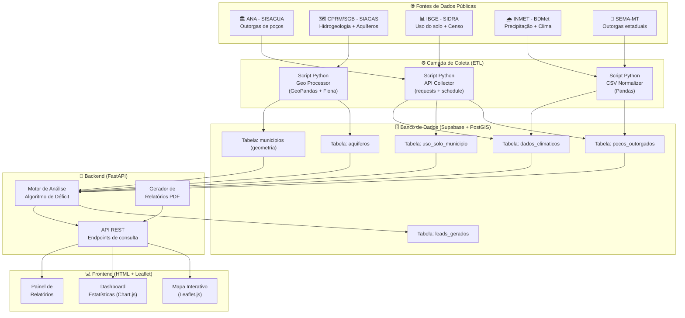
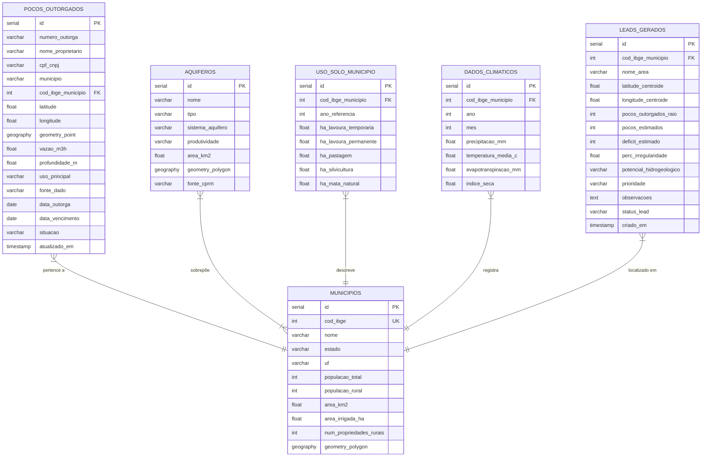
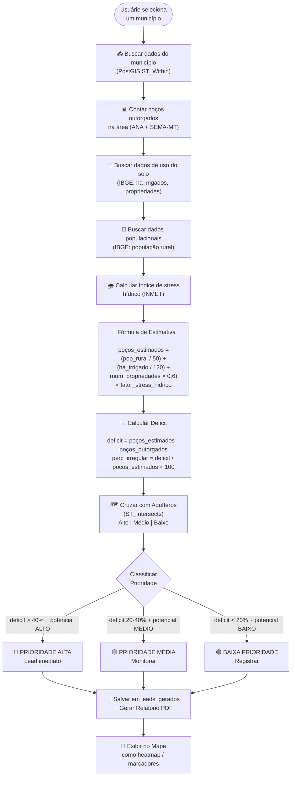
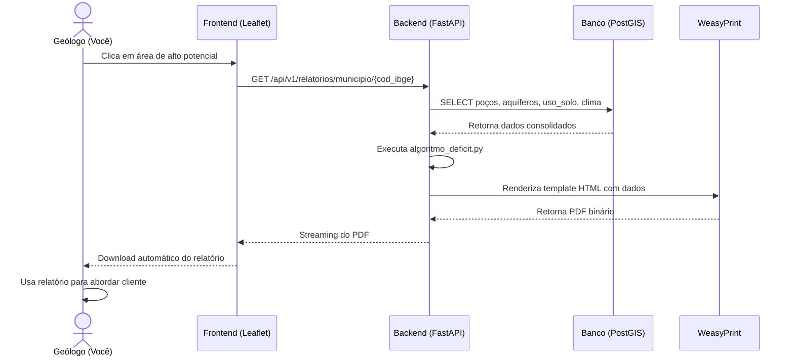
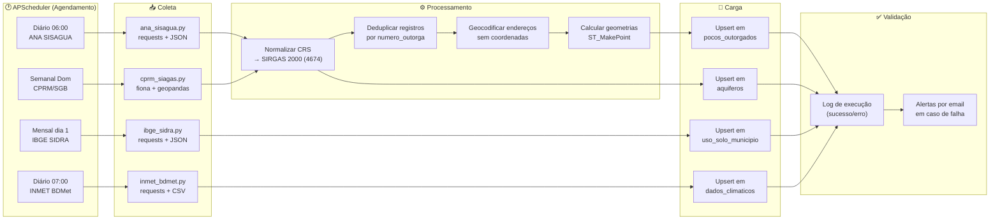
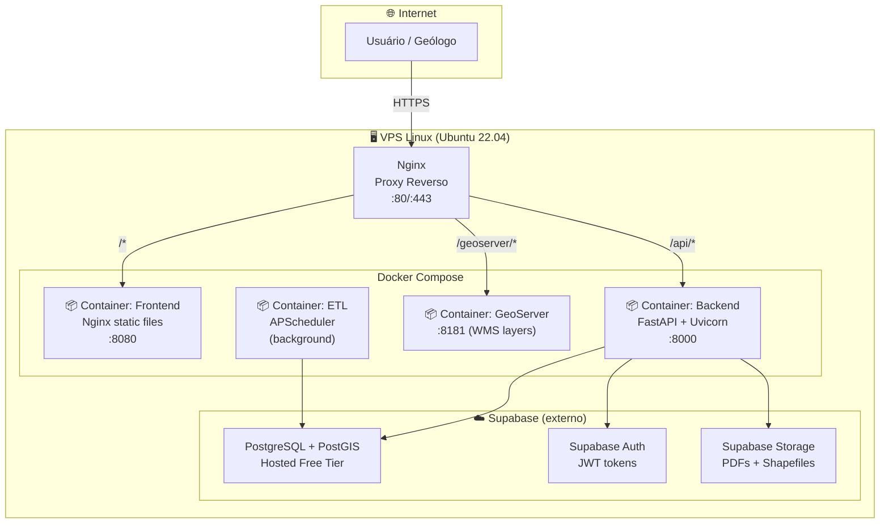
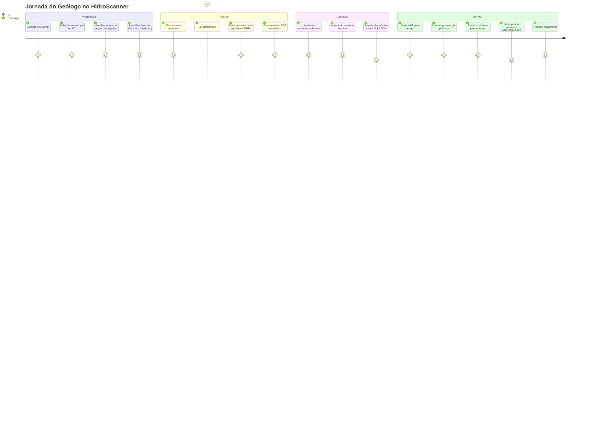
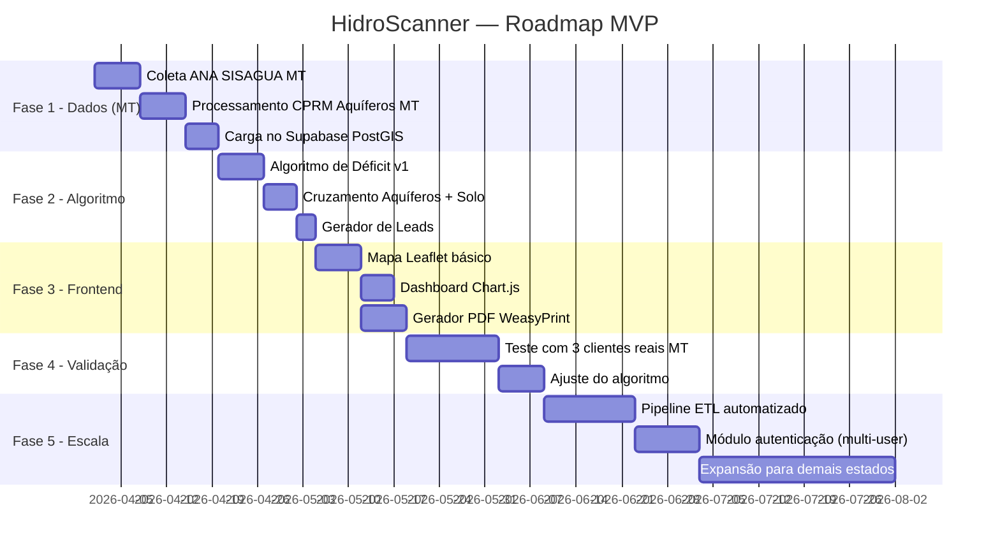

# 💧 HidroScanner — Documentação Técnica Completa
> *Plataforma de Identificação de Poços Irregulares e Potencial Hidrogeológico*  
> Versão 1.0 | Março 2026 | Mato Grosso → Brasil

---

## 1. Visão Geral do Sistema

O **HidroScanner** é uma plataforma SaaS de inteligência geoespacial voltada para o mercado de hidrogeologia no Brasil. Seu propósito primário é **cruzar dados públicos** de outorgas de poços, geologia, uso do solo e clima para identificar:

- Áreas com **poços tubulares irregulares** (sem outorga)
- Regiões com **alto potencial hidrogeológico** não explorado
- Propriedades rurais que são **leads qualificados** para serviços de regularização e prospecção

O sistema é desenvolvido **100% com ferramentas open source** e alimentado exclusivamente por **dados públicos e gratuitos** de órgãos federais e estaduais brasileiros.

### Objetivo Estratégico

```
FASE 1 (0–6 meses): Uso interno pelo consultor geólogo para geração de leads
FASE 2 (6–12 meses): Produto freemium para consultorias de MT
FASE 3 (12–24 meses): Expansão nacional + assinaturas B2B
```

---

## 2. Fontes de Dados Públicas (Entradas do Sistema)

| Órgão | Sistema | Dados | Formato | Acesso |
|-------|---------|-------|---------|--------|
| **ANA** | SISAGUA | Outorgas de poços (todo BR) | CSV / API REST | `sistemas.ana.gov.br/sisagua` |
| **CPRM/SGB** | SIAGAS | Poços cadastrados, hidrogeologia, aquíferos | Shapefile / WMS | `sgb.gov.br/sisgas` |
| **CPRM/SGB** | GeoSGB | Mapas geológicos e hidrogeológicos | WMS / GeoTIFF | `geosgb.cprm.gov.br` |
| **IBGE** | SIDRA | Uso do solo, censo agropecuário, população | API REST / CSV | `servicodados.ibge.gov.br` |
| **INMET** | BDMet | Precipitação, evaporação, temperatura | CSV diário | `bdmep.inmet.gov.br` |
| **ICMBio** | GeoServer | Unidades de conservação | WMS | `geoserver.icmbio.gov.br` |
| **SEMA-MT** | Portal Estadual | Outorgas estaduais (MT) | CSV/PDF | Portal da SEMA-MT |
| **ANA** | HidroWeb | Dados fluviométricos (rios) | CSV | `hidroweb.ana.gov.br` |

---

## 3. Fluxo Global de Entrada de Dados



---

## 4. Stack Tecnológica Completa (100% Open Source)

### 4.1 Visão por Camada

```mermaid
graph LR
    subgraph DADOS["Camada de Dados"]
        direction TB
        D1["PostgreSQL 15\n+ PostGIS 3.4"]
        D2["Supabase\n(BaaS gratuito)"]
        D3["GeoServer\n(opcional WMS)"]
    end

    subgraph ETL["Camada ETL / Processamento"]
        direction TB
        E1["Python 3.11"]
        E2["GeoPandas 0.14"]
        E3["Pandas 2.x"]
        E4["Fiona\n(leitura shapefiles)"]
        E5["Pyproj\n(projeções CRS)"]
        E6["Rasterio\n(imagens raster)"]
        E7["APScheduler\n(agendamento)"]
    end

    subgraph BACKEND["Camada Backend"]
        direction TB
        B1["FastAPI 0.110"]
        B2["SQLAlchemy 2.0\n(ORM)"]
        B3["Alembic\n(migrações DB)"]
        B4["WeasyPrint\n(geração PDF)"]
        B5["Pydantic v2\n(validação)"]
        B6["Uvicorn\n(servidor ASGI)"]
    end

    subgraph FRONTEND["Camada Frontend"]
        direction TB
        F1["HTML5 + CSS3\nVanilla JS"]
        F2["Leaflet.js 1.9\n(mapas)"]
        F3["Chart.js 4.x\n(gráficos)"]
        F4["OpenStreetMap\n(tiles base)"]
        F5["OpenLayers\n(WMS layers)"]
    end

    subgraph INFRA["Camada Infra / DevOps"]
        direction TB
        I1["Docker + Compose\n(containers)"]
        I2["Nginx\n(proxy reverso)"]
        I3["GitHub Actions\n(CI/CD)"]
        I4["VPS Linux\n(R$ 60-100/mês)"]
    end

    ETL --> DADOS
    BACKEND --> DADOS
    FRONTEND --> BACKEND
    INFRA --> BACKEND
    INFRA --> FRONTEND
```



### 4.2 Tabela Detalhada da Stack

| Camada | Ferramenta | Versão | Função | Custo |
|--------|-----------|--------|--------|-------|
| **BD Principal** | PostgreSQL | 15 | Banco relacional | R$ 0 |
| **Extensão GIS** | PostGIS | 3.4 | Consultas espaciais | R$ 0 |
| **BaaS** | Supabase | Free Tier | Hosting DB + Auth + API | R$ 0 |
| **ETL** | Python | 3.11 | Processamento de dados | R$ 0 |
| **Geo Python** | GeoPandas | 0.14 | Shapefiles, geometrias | R$ 0 |
| **Dataframes** | Pandas | 2.x | Manipulação CSV/Excel | R$ 0 |
| **Shapefiles** | Fiona | 1.9 | Leitura formatos GIS | R$ 0 |
| **Projeções** | Pyproj | 3.6 | Conversão CRS/SIRGAS | R$ 0 |
| **Rasters** | Rasterio | 1.3 | Imagens satélite | R$ 0 |
| **Agendamento** | APScheduler | 3.10 | Jobs diários de coleta | R$ 0 |
| **API Backend** | FastAPI | 0.110 | Endpoints REST | R$ 0 |
| **ORM** | SQLAlchemy | 2.0 | Queries ao banco | R$ 0 |
| **Migrações** | Alembic | 1.13 | Versionamento do schema | R$ 0 |
| **PDF** | WeasyPrint | 62 | Gerar relatórios PDF | R$ 0 |
| **Servidor** | Uvicorn | 0.29 | ASGI server | R$ 0 |
| **Mapas** | Leaflet.js | 1.9 | Mapa interativo frontend | R$ 0 |
| **Gráficos** | Chart.js | 4.x | Dashboards estatísticos | R$ 0 |
| **Tiles** | OpenStreetMap | — | Base cartográfica | R$ 0 |
| **WMS** | GeoServer | 2.25 | Servir camadas WMS | R$ 0 |
| **Container** | Docker | 26 | Empacotamento | R$ 0 |
| **Proxy** | Nginx | 1.25 | Roteamento HTTP | R$ 0 |
| **CI/CD** | GitHub Actions | — | Deploy automatizado | R$ 0 |
| **Hosting** | VPS Ubuntu | — | Servidor na nuvem | R$60-100/mês |
| **TOTAL** | | | | **~R$ 80/mês** |

---

## 5. Estrutura de Pastas do Projeto

```
hidroscanner/
│
├── 📁 backend/                         # API FastAPI + lógica de negócio
│   ├── 📁 app/
│   │   ├── 📁 api/                     # Rotas da API REST
│   │   │   ├── 📁 v1/
│   │   │   │   ├── endpoints/
│   │   │   │   │   ├── pocos.py        # CRUD e consulta de poços
│   │   │   │   │   ├── municipios.py   # Dados por município
│   │   │   │   │   ├── aquiferos.py    # Consulta de aquíferos
│   │   │   │   │   ├── relatorios.py   # Geração de relatórios PDF
│   │   │   │   │   └── leads.py        # Gestão de leads gerados
│   │   │   │   └── router.py
│   │   │   └── deps.py                 # Dependências (auth, DB session)
│   │   │
│   │   ├── 📁 core/                    # Configurações centrais
│   │   │   ├── config.py               # Variáveis de ambiente
│   │   │   ├── security.py             # JWT, autenticação
│   │   │   └── database.py             # Conexão com PostgreSQL/Supabase
│   │   │
│   │   ├── 📁 models/                  # Modelos SQLAlchemy (tabelas)
│   │   │   ├── poco.py                 # Model: pocos_outorgados
│   │   │   ├── aquifero.py             # Model: aquiferos
│   │   │   ├── municipio.py            # Model: municipios
│   │   │   ├── uso_solo.py             # Model: uso_solo_municipio
│   │   │   ├── clima.py                # Model: dados_climaticos
│   │   │   └── lead.py                 # Model: leads_gerados
│   │   │
│   │   ├── 📁 schemas/                 # Pydantic (validação de dados)
│   │   │   ├── poco.py
│   │   │   ├── relatorio.py
│   │   │   └── lead.py
│   │   │
│   │   ├── 📁 services/                # Lógica de negócio
│   │   │   ├── algoritmo_deficit.py    # 🔑 Motor de análise de irregularidades
│   │   │   ├── potencial_hidro.py      # Cálculo de potencial hidrogeológico
│   │   │   ├── gerador_relatorio.py    # Geração de PDF com WeasyPrint
│   │   │   └── alertas.py              # Outorgas vencendo
│   │   │
│   │   └── main.py                     # Entry point FastAPI
│   │
│   ├── 📁 migrations/                  # Alembic (versionamento do schema)
│   │   ├── env.py
│   │   └── versions/
│   │       ├── 001_create_tables.py
│   │       ├── 002_add_postgis.py
│   │       └── 003_add_leads_table.py
│   │
│   ├── requirements.txt
│   └── Dockerfile
│
├── 📁 etl/                             # Pipeline de coleta de dados
│   ├── 📁 collectors/
│   │   ├── ana_sisagua.py              # Coleta outorgas da ANA (API REST)
│   │   ├── cprm_siagas.py              # Coleta hidrogeologia CPRM (WMS/Shapefile)
│   │   ├── ibge_sidra.py               # Coleta uso do solo e censo (API)
│   │   ├── inmet_bdmet.py              # Coleta dados climáticos (CSV)
│   │   └── sema_mt.py                  # Coleta outorgas estaduais MT
│   │
│   ├── 📁 processors/
│   │   ├── normalizar_coordenadas.py   # Converter CRS para SIRGAS 2000
│   │   ├── enriquecer_pocos.py         # Join espacial: poço + aquífero + solo
│   │   ├── calcular_deficit.py         # Estimativa de déficit por município
│   │   └── geocodificar.py             # Endereços → coordenadas (Nominatim)
│   │
│   ├── 📁 loaders/
│   │   └── supabase_loader.py          # Upsert no Supabase/PostgreSQL
│   │
│   ├── 📁 templates/
│   │   └── relatorio_base.html         # Template HTML para PDF
│   │
│   ├── scheduler.py                    # APScheduler: jobs diários/semanais
│   ├── run_etl.py                      # Execução manual do pipeline
│   └── requirements_etl.txt
│
├── 📁 frontend/                        # Interface Web
│   ├── 📁 css/
│   │   ├── main.css                    # Estilos globais
│   │   ├── mapa.css                    # Controles do mapa
│   │   └── dashboard.css               # Cards e gráficos
│   │
│   ├── 📁 js/
│   │   ├── mapa.js                     # Inicialização Leaflet + camadas
│   │   ├── filtros.js                  # Filtros de município/tipo/situação
│   │   ├── dashboard.js                # Chart.js (gráficos de déficit)
│   │   ├── relatorios.js               # Geração e download de PDF
│   │   ├── api.js                      # Wrapper fetch() para a API
│   │   └── auth.js                     # Autenticação (Supabase Auth)
│   │
│   ├── 📁 pages/
│   │   ├── index.html                  # Mapa principal
│   │   ├── dashboard.html              # Estatísticas e métricas
│   │   ├── municipio.html              # Detalhe por município
│   │   ├── relatorio.html              # Visualização de relatório
│   │   └── login.html                  # Tela de autenticação
│   │
│   └── 📁 assets/
│       ├── icons/                      # Ícones de poços, alertas
│       └── img/
│
├── 📁 geoserver/                       # Configuração GeoServer (WMS layers)
│   ├── workspaces/
│   │   └── hidroscanner/
│   │       ├── aquiferos_mt.sld        # Estilização de aquíferos
│   │       └── pocos_outorgados.sld    # Estilização de poços
│   └── docker-compose.geoserver.yml
│
├── 📁 data/                            # Dados brutos baixados (gitignore)
│   ├── 📁 raw/
│   │   ├── ana/                        # CSVs baixados do SISAGUA
│   │   ├── cprm/                       # Shapefiles do SGB/CPRM
│   │   ├── ibge/                       # Malhas municipais + censo
│   │   └── inmet/                      # Séries climáticas
│   └── 📁 processed/                   # Dados já normalizados para carga
│
├── 📁 docs/                            # Documentação técnica
│   ├── hidroscanner_documentacao.md    # Este arquivo
│   ├── schema_banco.md                 # Diagrama do banco de dados
│   └── api_reference.md               # Endpoints da API
│
├── docker-compose.yml                  # Stack completa (API + DB + Nginx)
├── .env.example                        # Variáveis de ambiente (modelo)
├── .gitignore
└── README.md
```

---

## 6. Schema do Banco de Dados (PostGIS)



---

## 7. Fluxo do Algoritmo de Detecção de Irregularidades



---

## 8. Fluxo de Geração de Relatório (Lead → PDF)



---

## 9. Fluxo de Pipeline ETL (Coleta Automática de Dados)



---

## 10. Arquitetura de Deployment (Produção)



---

## 11. Fluxo de Uso — Perspectiva do Geólogo



---

## 12. Catálogo de Serviços (o que fazer com o lead)

| Serviço | Descrição | Entregável | Duração | Valor (MT) |
|---------|-----------|------------|---------|-----------|
| **Diagnóstico Hidrogeológico** | Análise de dados públicos + parecer técnico inicial | Relatório 5-10p + ART | 3-5 dias | R$ 800 – R$ 2.000 |
| **Regularização de Poço** | Laudo técnico + relatório para processo de outorga | Relatório completo + ART + protocolo ANA/SEMA | 15-30 dias | R$ 4.000 – R$ 12.000 |
| **Locação de Poço Novo** | Levantamento geofísico + relatório de locação | Laudo geofísico + mapa de locação + ART | 3-7 dias campo | R$ 3.000 – R$ 8.000 |
| **Laudo de Qualidade da Água** | Acompanhamento de coleta + interpretação de análises | Relatório de qualidade + recomendações | 5-10 dias | R$ 1.500 – R$ 3.000 |
| **Relatório de Interferência** | Análise de conflito entre poços vizinhos | Parecer técnico | 5-10 dias | R$ 2.000 – R$ 5.000 |
| **Monitoramento Anual** | Visitas semestrais + relatório de acompanhamento | 2 relatórios/ano + ART | Contínuo | R$ 1.500 – R$ 4.000/ano |
| **Renovação de Outorga** | Processo de renovação antes do vencimento | Relatório + protocolo | 15-30 dias | R$ 2.500 – R$ 6.000 |
| **Mapeamento para Prefeituras** | Levantamento de poços no município | Mapa shapefile + relatório executivo | 30-60 dias | R$ 15.000 – R$ 50.000 |

---

## 13. Roadmap de Desenvolvimento



---

## 14. Estimativa de Custos e ROI

### Custo de Operação (mensal)

| Item | Custo |
|------|-------|
| VPS Linux (2vCPU, 4GB RAM) | R$ 80/mês |
| Supabase Free Tier | R$ 0 |
| Domínio .com.br | R$ 5/mês (anualizado) |
| **Total operacional** | **~R$ 85/mês** |

### ROI Estimado (Uso Interno — MT)

| Cenário | Leads/mês | Conversão | Contratos | Ticket médio | Receita |
|---------|-----------|-----------|-----------|-------------|---------|
| Conservador | 20 | 5% | 1 | R$ 8.000 | R$ 8.000 |
| Moderado | 50 | 10% | 5 | R$ 8.000 | R$ 40.000 |
| Otimista | 100 | 15% | 15 | R$ 8.000 | R$ 120.000 |

**ROI no cenário conservador:** 94x o custo mensal de operação.

---

## 15. Aspectos Legais e Normativos

| Tema | Regulamentação | Implicação para o Sistema |
|------|----------------|--------------------------|
| **Outorga de poços tubulares** | Lei 9.433/97 (PNRH) | Base legal do problema que o sistema resolve |
| **Competência federal/estadual** | Rios interestaduais = ANA; rios estaduais = SEMA-MT | Sistema deve distinguir as outorgadoras |
| **ART obrigatória** | Lei 6.496/77 + CFP/CREA | Todo relatório gerado deve indicar necessidade de ART |
| **LGPD** | Lei 13.709/18 | Dados de proprietários individuais requerem consentimento |
| **Acesso a dados públicos** | LAI (Lei 12.527/11) | Dados da ANA/CPRM/IBGE são de livre acesso e uso |
| **Penalidades por poço irregular** | Resolução ANA nº 707/2004 | Multa + interdição – argumento de venda |

> [!WARNING]
> O sistema deve ser enquadrado sempre como **"estimativa regional baseada em dados públicos"**, nunca como acusação individual de irregularidade. Os relatórios devem incluir disclaimer técnico.

---

## 16. Disclaimer Padrão para Relatórios

```
NOTA TÉCNICA IMPORTANTE:
As estimativas de déficit de outorgas apresentadas neste relatório são calculadas 
com base em dados públicos disponibilizados pela ANA, CPRM e IBGE, e representam 
uma análise estatística regional. NÃO constituem confirmação de irregularidade 
individual, infração administrativa ou acusação de qualquer natureza.

A regularização de poços deve ser avaliada caso a caso por profissional habilitado 
(geólogo/engenheiro de minas) com emissão de ART, conforme legislação vigente.

Elaborado por: [Nome do Geólogo] | CREA/CFP: [Número] | [Data]
```

---

*Documento gerado em: Março 2026*  
*Sistema: HidroScanner v1.0 — Mato Grosso Pilot*  
*Autor: Agrageo Consultoria*
